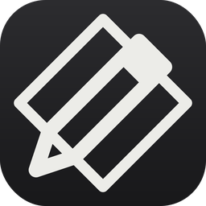

# Graphite — PDF, precisely.

A native Windows desktop app for viewing, editing, annotating and converting PDF documents.
Built with WPF on .NET 8, styled with an original "liquid glass" design language — floating
translucent toolbars and pill controls over the Windows 11 Mica backdrop.



## Features

**Viewing** — PDFium-based rendering (fast and high-fidelity), smooth zoom (buttons, Ctrl+wheel,
fit-width), continuous, single-page and two-page spread modes, page thumbnails, bookmarks/outline
navigation, full-text search with per-page highlights, and multi-tab support for several open files.

**Reading** — fullscreen reading mode (F11, Esc to leave), inverted page colors for comfortable
dark reading (toggle in the floating page bar), and reading history: jump around via bookmarks,
search or go-to-page, then walk back and forward with Alt+Left / Alt+Right.

**Command palette** — Ctrl+K opens a searchable palette with every command in the app;
type a few letters, Enter runs it.

**Printing** — Ctrl+P prints through the system dialog; pages are rasterized at 300 dpi with
annotations included and fitted to the printable area.

**Page editing** — add (blank or from another PDF), delete, reorder, rotate and extract pages;
merge multiple PDFs into one; split a PDF into single-page files. Right-click any thumbnail
for per-page operations. Annotations travel with their pages through every operation.

**Content editing** — an Edit Text tool (drag over a region, type replacement text and pick the
text size — or let Graphite match the original; the region is covered and re-typeset, which is
how most PDF editors work under the hood since PDF has no reflowable text model) and a
Place Image tool for inserting images onto a page.

**Annotation & markup** — highlight, underline and strikethrough that snap to words, freehand ink,
rectangles, ellipses, arrows, free text (with size control), sticky notes, and a signature tool:
draw your signature once and stamp it onto any page (it's saved between sessions). Every
annotation supports a comment and threaded replies. The Markup panel lists everything in the
document for review; click a card to jump to it. Annotations are written as standard PDF
annotations, so they open in any other viewer. Undo/redo (Ctrl+Z / Ctrl+Y) covers annotations
and page operations alike.

**Security & info** — password-protected PDFs open with a password prompt, and any document can
be saved as an encrypted copy (128-bit, from the ⋯ menu). A properties dialog shows title,
author, dates, producer, PDF version, page size and file size.

**Conversion** — export to Word (.docx, reconstructed paragraphs), Excel (.xlsx, one sheet per page
with inferred columns), PowerPoint (.pptx, one slide per page) and PNG/JPEG/WebP images.
Opening a Word/Excel/PowerPoint file converts it to PDF automatically (uses the installed
Microsoft Office via COM; requires Office).

**OCR** — Tesseract-based recognition for scanned pages. Recognized pages become searchable and
selectable immediately, and an invisible text layer is baked into the PDF so it stays searchable
after saving, in any viewer.

**Platform** — dark/light themes (persisted), Windows 11 Mica backdrop with glass panels,
system accent color, per-monitor DPI awareness, drag-and-drop, recent files, a OneDrive
quick-open button (uses your local OneDrive sync folder), and a script to register the .pdf
file association.

## Building

Requirements: **Windows 10/11**, **Visual Studio 2022** (or the .NET 8 SDK) with the
".NET desktop development" workload.

```
dotnet build Graphite.sln -c Release
dotnet run --project src/Graphite.App
```

Or open `Graphite.sln` in Visual Studio and press F5. NuGet restores everything
(PDFtoImage/PDFium, PdfSharp, PdfPig, DocumentFormat.OpenXml, ClosedXML, Tesseract,
CommunityToolkit.Mvvm).

### Optional setup

- **OCR data** — `powershell -File tools\get-tessdata.ps1` downloads `eng.traineddata`
  into `src/Graphite.App/tessdata` (copied next to the exe on build). Pass
  `-Languages eng,deu,...` for more languages.
- **File association** — after building:
  `powershell -File tools\register-file-association.ps1 -ExePath <path>\Graphite.exe`,
  then choose Graphite for `.pdf` in Settings → Default apps (Windows requires that final
  choice to be made by the user).

## Architecture

```
Graphite.sln
├─ src/Graphite.Core     ── UI-independent engine (net8.0)
│   ├─ Rendering/        PDFium rasterizer (PDFtoImage), thread-safe
│   ├─ Text/             PdfPig text index: word geometry, search, outline, selection
│   ├─ Pdf/              PdfSharp page surgery: merge, split, extract, rotate, reorder
│   ├─ Annotations/      model + codec that reads/writes real PDF annotations
│   ├─ Editing/          cover-and-replace text edits, image placement
│   ├─ Ocr/              Tesseract engine + invisible-text-layer writer
│   └─ Export/           docx / xlsx / pptx / image exporters, Office→PDF via COM
└─ src/Graphite.App      ── WPF shell (net8.0-windows)
    ├─ Themes/           light/dark palettes, styles, original icon geometry
    ├─ ViewModels/       Main / Document / Page / Annotation (CommunityToolkit.Mvvm)
    ├─ Controls/         AnnotationLayer — per-page interactive overlay
    ├─ Services/         theme/settings, signature store, printing
    ├─ Views/            MainWindow + dialogs (input, edit-text, password, signature, properties)
    └─ Interop/          Mica backdrop + dark title bar (DWM)
```

Design decisions worth knowing:

- **Operations are pure** (`bytes in → bytes out`). Before any structural operation the current
  annotations are baked into the PDF, and re-read afterwards — so they stay glued to their pages
  through deletes, moves and merges.
- **Rendering is decoupled from layout.** Pages lay out at `size × zoom` immediately; bitmaps
  re-render ~1.5× oversampled in the background (debounced on zoom), so zooming feels instant.
- **The viewer virtualizes.** Pages render lazily as they scroll into view; thumbnails likewise.

## Design language

Graphite pairs its warm-gray monochrome identity with a liquid-glass treatment that sits
naturally on Windows 11: a floating glass command bar and a pill-shaped page-control bar hover
over the document, side panels are translucent gradient glass with a luminous top edge and soft
16px radii, tabs are pills, and everything floats over the Mica backdrop with soft shadows.
Buttons animate on hover and compress slightly on press. The Windows accent color appears
sparingly — checked tools, focus rings, the unsaved-changes dot — while functional color stays
reserved for the document itself: highlights, ink and shapes. Icons remain original 1.3px
hairline stroke geometry (no icon font).

## Known limitations

- Text editing is cover-and-replace (see above) — original fonts are not re-embedded.
- Word/Excel export reconstructs layout heuristically from text geometry; complex layouts
  and tables degrade gracefully but imperfectly.
- Creating PDFs *from* Office files requires Microsoft Office to be installed.
- Annotations on pages rotated via `/Rotate` metadata (rather than upright content) can be
  offset; upright documents — the overwhelming majority — behave correctly.
- Graphite writes annotations without appearance streams; virtually all viewers (Acrobat,
  browsers, SumatraPDF) regenerate them automatically.
